# iot-dotnet-2026
IoT 개발자 닷넷 리포지토리


## 1dlfck


### C# 기본

- 현 세대 프로그래밍 언어 랭킹 5위
- C++, 파이썬, 자바와 동일한 객체지향 프로그래밍 언어
- MS 윈도우에 종속적이었지만 현재 멀티플랫폼으로 변환 중
- 자마린으로 모바일 앱 개발 가능
- 유니티 게임 엔진 기본 스크립트 채택
- 스마트 팩토리, KIOSK 개발 등에 많이 활용


### C#은 닷넷 프레임 워크 위에서 동작함 
- 자바는 버주얼머신 위에서 동작
- C#은 닷넷 프레임워크(VM)위에서 동작함
- .NET 프레임워크의 구조를 따르면 무슨 언어든지 동작가능
    - C#, VB, J#, F#, C++.NET, Python....


https://wikidocs.net/227163

- 버전 명칭
    - .NET Framwork > .NET Core > .NET 5.0 이상

### C# 기본 구현
1. Visual studio 실행
2. C# 이 없으면 추가 기능 설치
    - ASP.NET 및 웹 개발 
    - .NET 데스크톱 개발 선택 
3. 비주얼스튜디오 재실행
4. 새 프로젝트 만들기
5. 언어 C# 선택
6. 콘솔 앱 선택
7. 새로 프로젝트 구성 : 프로젝트 명, 저장 위치, 솔루션 이름 지정
8. 추가정보: 프레임워크 선택, `최상위 문 사용안함`을 체크할 것


### C# 기본문법

- 주석 : 한 줄 주석(//), 여러줄 주석(/**/), xml 주석(///)
- 변수와 타입
    - 초기화 :`접근제한자 타입 변수명`
    - sbyte, byte, short, ushort, int, uint. long, ulong
    - float, double, decimal, char, bool
    

- 연산자 
    - c문법 동일
- 제어문
    - if, for, while
- 메서드
- 컬렉션
- 파일 입출력
- 객체지향
    - C++ 객체지향 클래스 내용과 동일 
    - 클래스 : 명사와 동사의 집합
    ```cs
    class Person {
        public string Name;

        public void Eat() {
            Console.WriteLine(Name + "이(가) 먹다.");
        }
    }

    static void Main() {
        Person p1 = new Person();
        p1.Name = "길동";
        p1.Eat();
    }
    ```
    - 생성자 : 클래스명과 동일한 특수메서드
    - 오버로딩 지원 : 메서드 파라미터 갯수가 다르면 가능
    - 상속: 동일하게 사용가능, 단일 클래스 상속 지원(멀티클래스는 인터페이스로 대체)
    - 오버라이딩 가능: 부모클래스의 메서드와 다르게 동작하는 메서드로 변경
    - this : 자기 클래스를 지칭할 때 


- 클래스 속성에서 
    - get; : 속성의 값을 가져올 수 있음
    - set; : 속성의 값을 변경할 수 있음
    - get; set; : 속성값 변경 및 가져오기 가능


- 컬렉션 
    - 배열, 리스트 등 여러요소를 묶어서 사용하는 구조
    - ArrayList, List, Hashtable, Dictionary, Stach, Queue, Hashset ....
    - foreach : 파이썬에서 for i in range(n) 과 동일한 기능
    - 배열보다 컬렉션을 사용할 것

- 예외처리 
    - try ~ catch ~ finally 형식 사용


### MSDN


### C# 프로그래밍
- C#으로 프로그램을 구현한다는 뜻
    - 윈도우 애플리케이션(winapp), 웹앱, 유니티, 모바일(MAUI), 키오스크(WPF)
    - GUI 활용
### 윈앱

- WinForms, Window Application, GUI -> WinApp으로 통일해서 명명
    - Windows Forms : 가장 오래된 윈앱 개발 방식
    - WPF: 좀 더 최신의 윈앱 개발 방식

- 윈앱 개발에는 각 두개로 구분되어 있음
    - .NET Framework : .NET Framework 4.8 이전 구형 개발방식 
    - 기본 : .NET 5.0 이상의 최신 개발방식

### 윈폼즈 앱 구현

1. 새프로젝트
2. 프로젝트명, 위치, 솔루션명 지정해서 다음으로 넘김
3. 프레임워크 .NET 10.0 선택 후 
4. IDE 툴에서 펑션키 f4로 속성창 오픈
5. 보기 > 도구상자 클릭 
6. 기본 개발화면 
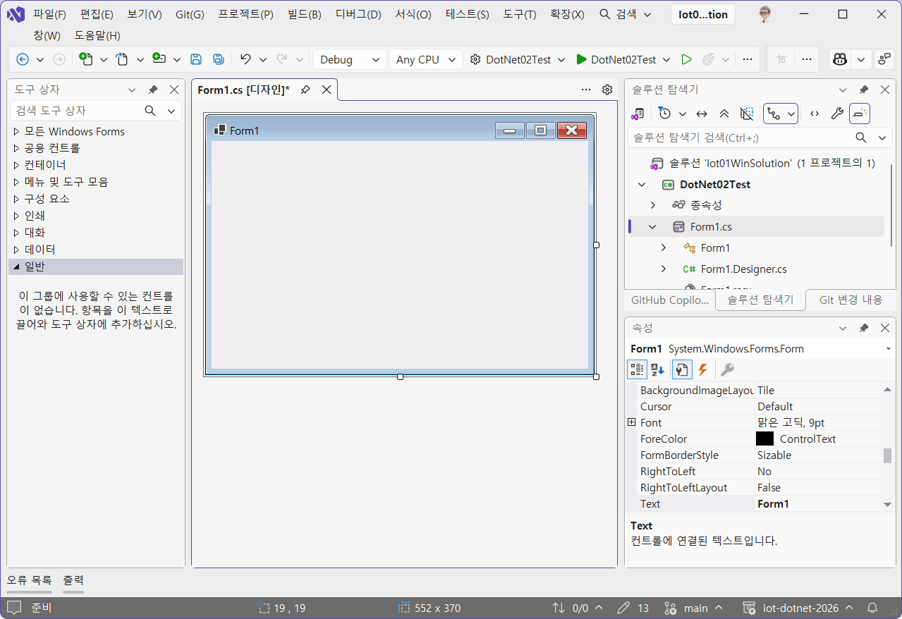
7. 저장할때는 항상 ctrl+shift+s 로 저장할것
8. 도구상자의 컨트롤을 디자인 화면으로 드래그해서 구성 
9. 컨트롤의 속성 변경으로 디자인 적용 
10. 컨트롤의 이벤트 추가로 기능 구현
11. 디자이너 화면 `f7` <--> 비하인드코드 `shift + f7

### 트러블 슈팅
- 윈폼즈 개발시 디자인 화면에서 버튼을 더블클릭 이벤트 추가할 경우 발생하는 오류
- 생성된 이벤트 선언문에 대한 .cs 파일 이벤트 핸들러가 생성되지 않아서 발생


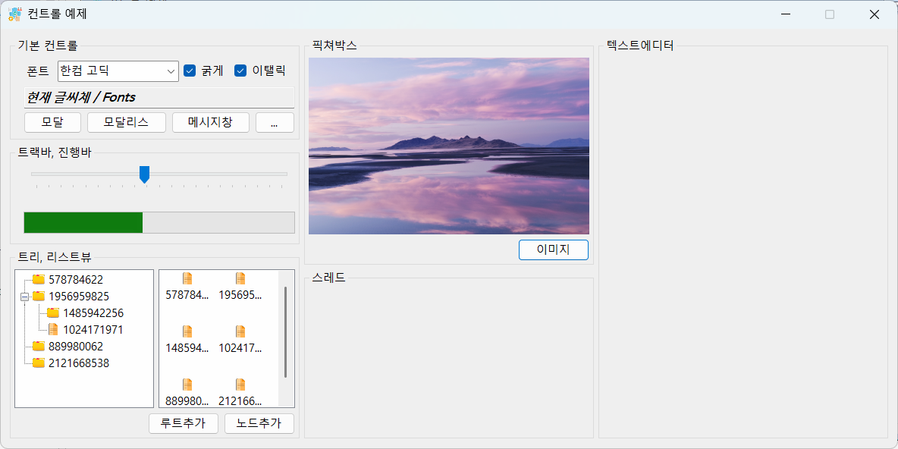

### 윈폼즈
- 모달, 모달리스  : 부모창과 자식창의 관계
    - 모달 : 서브창 종료전에는 부모창 종료 불가
    - 모달리스 : 서브창 종료와 관계 없이 부모창 제어 가능

- 속성 변경방법
    - 디자인타임 변경 : 작업시 속성창의 속성값 변경
    - 런타임 변경 : 비하인드 코드 내에서 속성값을 변경 실행시 변경되는 것


### 스레드 사용
- 윈앱 자체가 UI 스레드 사용
- 반복작업을 스레드 없이 수행하면 UI 스레드와 충돌발생 - (응답없음)
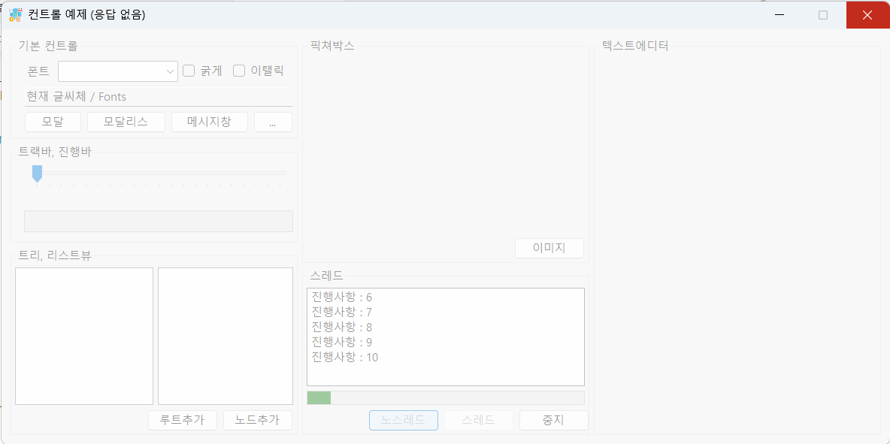

- C#에서 스레드 사용방법 
    - 직접 스레드 클래스 생성
    - 백그라운드워커 클래스 사용


## 윈앱 기본컨트롤 예제앱
- 라벨, 콤보박스, 체크박스
- 메시지박스, 다이얼로그
- 트랙바, 진행바
- 트리뷰, 리스트 뷰, 이미지 리스트, 픽쳐박스
- 리치텍스트 박스
- 백그라운드 워커(스레드)


### 비동기 처리 앱
- 비동기로 호출할 메서드 앞에 await 추가
- 비동기 메서드 호출하는 부모메서드 접근제어키워드와 리턴값 사이에 async 추가
- 일반 메서드를 비동기메서드로 변경
- 리턴값이 있을 때 변경 long -> Task<long>
- 아주 간단하게 스레드 처리가 가능

- 동기화 복사는 복사 기능 도중 , 다른 이벤트 사용불가 
- 비동기화 복사는 다른 이벤트 가능


### DB 연동 앱
- MySQL bookrentalshop 연동
#### DB 연동 구현
1. NuGet MySQL커넥터 설치
2. databaseHelper 클래스 생성, 작성
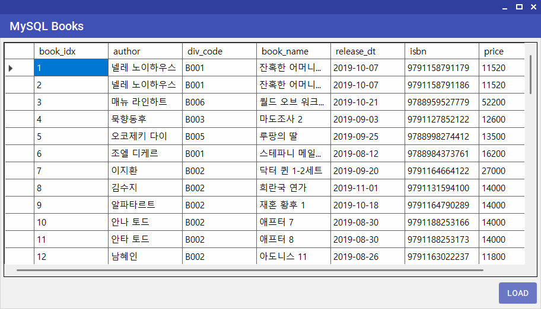
#### 외부 라이브러리 활용
- 윈폼즈 앱 개발시 직접 디자인이 어려움
- 3rd 파티사에서 여러 라이브러리 제공
- 예전에는 따로 설치, 내프로젝트에 복사 붙여넣기
-  Nuget Package 존재 - python pip같은느낌

#### C# 개발 팁
- 문법 중 새 객체 생서할 때 초기화 방법
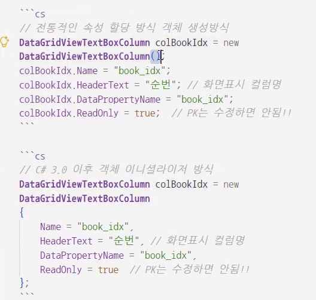

#### Nuget 설치 순서
1. 프로젝트 마우스 오른쪽 버튼 > NuGet 패키지관리 클릭
2. 찾아보기에서 필요한 라이브러리 검색
3. 패키지 세부사항 > 종속성 현재 프로젝트 호환성 확인
4. 설치


## 웹앱

### 서버 클라이언트 
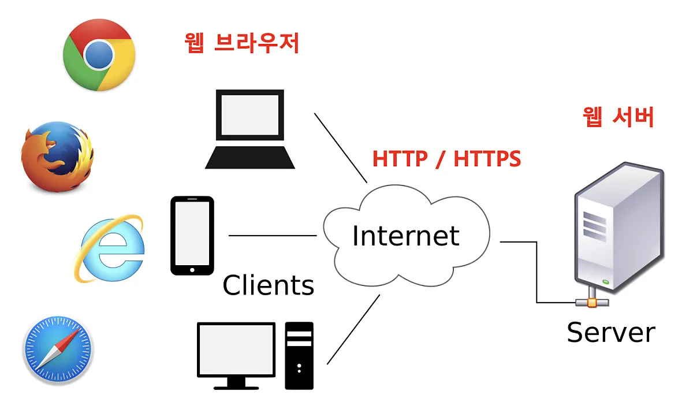
### 웹 서비스 
- 통칭해서 웹 서버와 API 서비스 모두 웹 서비스라고 칭함 
- API 서버 - 데이터만 전달하는 형태의 웹 서비스 
    - 공공데이터포털, 네이버API, 구글 API

### ASP.NET
1. 새 프로젝트 - ASP.NET Core 웹앱 선택
2. 프로젝트명, 위치, 솔루션명 입력 다음
3. 프레임워크 선택, 인증 유형 없음, https 체크 , 최상위 문 사용안함
4. 나머지는 기존상태 유지

### 일반 웹서버 
- HTML, CSS, Js 사용 웹화면 개발 + 백엔드
- 기본적인 웹서버 개발

### ASP.NET API서버
1. 새 프로젝트 - ASP.NET Core 웹API 선택
2. 위와 동일 
3. OpenAPI, 컨트롤러 사용 체크 나머지 동일

### http 메서드
- get - select 동일 조회
- post - insert 와 동일, 등록 위주
- put - update와 동일
- delete - delete와 동일


## WPF
- Windows Presentation Foundation - ui 프레임워크
    - Winforms보다 더 현대적인 ui 제작 가능
    - 애니메이션, 2d/3d 그래픽 미디어적인 강력함
    - 데이터(DB, JSon 등) 바인딩 기능 강력
    - XAML(XML 기반 UI설계방식)기반으로 디자인, 로직과 완전 분리 가능
    - UI와 로직의 완전분리를 위해 `MVVM패턴`  사용이 쉬움

### WPF 특징
- XAML 사용 - 안드로이드, Qt 등 기존 XML 기반의 디자인이 가능한 사람이면 누구나 가능
    - 드래그앤드랍으로 기본 디자인 후 세밀한 조정은 코딩으로 가능
    ```xml
    <Button Content = "Hello" />

    ```
    -xaml 디자이너
    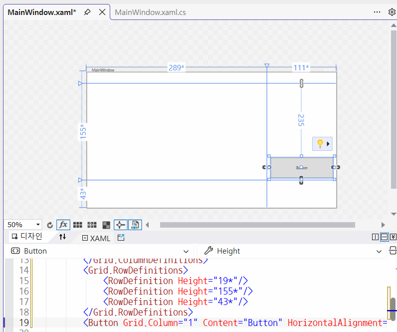

- GPU 가속 렌더링
    - WinForms는 CPU 기반GDI+ 렌더링으로 복잡하고 느렸음
    - 다이렉트x 기반으로 그래픽 처리가 부드럽다 
    - 애니메이션, 3D, 반투명효과, 그림자, 블러 등

- 스타일, 테마 적용이 쉬움
    - html, css 와 유사
    - 디자인 자유도가 아주 높음

### WPF 프로젝트 구성
- App.xaml : 프로그램 시작점에 들어가는 스타일 등
    - App.xaml.cs : App.xaml의 코드를 작성하는 파일
- MainWindow.xaml : 메인폼 디자인과 동일
    - MainDwindow.xaml.cs : MainWindow.xaml의 코드를 작성하는 파일


### WPF MainWindo.xaml 디자인 순서
1. Grid. Stackpanel, canvas 등으로 구역 나누기
2. 구역별로 컨트롤 배치 
3. xaml코드 수정하기
    - Blend for visual studio 에서
4. xaml.cs 비하인드코드 작성
    - 모든 객체는 Margin, Padding 존재
    - Achoring 표시: 체인이 연결/끊김으로 표시    
    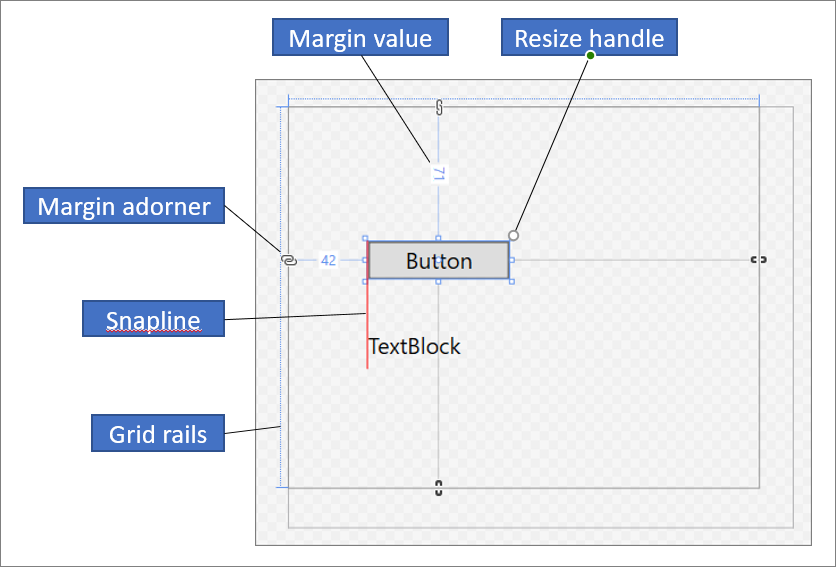
    - 그리드를 나누는 표시
    - 각 나눈 영역은 n배(*)로 표시
    - *가 없으면 픽셀 고정 사이즈
    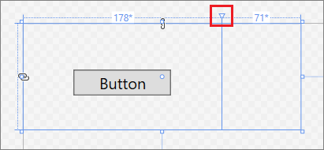
5. 새 창 추가 
6. App.xaml에서 시작하는 창 변경
7. xaml은 대부분 도구상자, 속성을 사용하는 것보다 직접 xaml코딩으로 함

### 네비게이션 앱
- 하나의 창에 여러 페이지를 전환하면서 사용하는 방식앱
    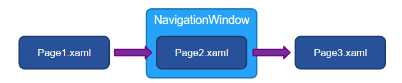
#### 화면 레이아웃 구성
- grid : 가장 기본 내부에 들어오는 객체가 그리드 셸을 가득 채움
    - Margin : 숫자하나(상하좌우 동일 여백), 두개(좌우/상하), 네개(좌, 상, 우, 하)
- stackpanel : 내부의 객체가 순차적으로 쌓임
    - Orientation = Vertical 이 기본
- dockpanel : 내부의 객체를 상하좌우 중앙으로 분리
    - DockPanel.Dock에 left right top bottom 으로 위치 지정
- canvas : 

#### 이미지 동영상
- 이미지 - 솔루션 탐색기 선택, 속성 > 빌드 작업 리소스 변경
- 동영상
    - 솔루션 탐색기 선택, 속성 > 빌드 작업 내용으로 변경
    - 출력 디렉토리로 새 버전이면 복사, 항상 복사 중 선택
    - bin 아래 debug.release 폴더에 복사
    - MediaElement Source 할당작업을 코드 비하인드에서 처리

#### 컨트롤 디자인
- 일반 버튼
- 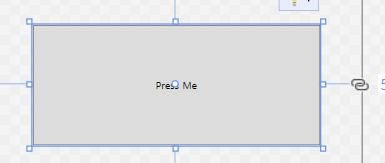

```xml
<Button Margin="50" Click="Button_Click" Content="Press Me">
    <Button.Template>
        <ControlTemplate TargetType="Button">
            <Grid>
                <Rectangle RadiusX="12" RadiusY="12" 
                           Fill="#25A3FB" Stroke="DarkBlue" StrokeThickness="4" />
                <Label Content="{TemplateBinding Content}" Foreground="White" FontSize="20" FontWeight="ExtraBold"                                   
                       HorizontalAlignment="Center" VerticalAlignment="Center"/>
            </Grid>
        </ControlTemplate>
    </Button.Template>
</Button>
```
- ControlTemplate TargetType 을 Button 지정
- 보통 그리드 안에 여러 객체를 위치
- 부모객체(버튼)의 속성을 가져다 쓰려면 `{TemplateBinding 속성명}` 형대로 설정


#### 리소스 디자인
- 컨트롤 디자인은 하나의 객체만 가능 
- 컨트롤 디자인을 적용하려면 객체마다 전부 복사해야함
- 적용방법
    1. 해당 페이지 리소스 생성하면 페이지 내 해당 객체들만 적용
    2. app.xaml에 리소스 생성하면 프로젝트 내 모든 객체에 적용
    3. xaml로 리소스 파일 만들고, 코드내에서 불러와서 적용
page.resources, window.Resources. application.resources 태그 내에 작성

```xml
    <Page.Resources>
        <Style x:Key="BlueShadowByttonStyle" TargetType="Button">
            <Setter Property="Template">
                <Setter.Value>
                    
                </Setter.Value>
            </Setter>
        </Style>
    </Page.Resources>
```
- x:key를 삭제하면 페이지, 창 , 버튼 모두에 적용됨
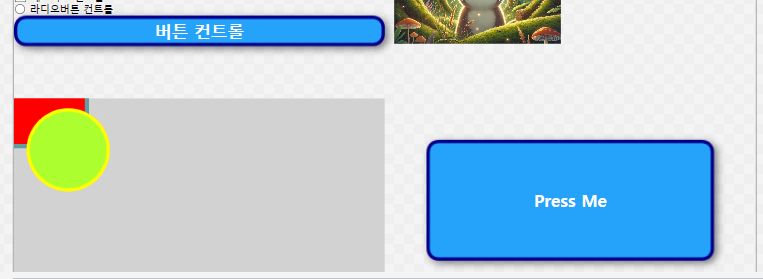

- key를 적용하려면 해당 객체에 style 속성 사용
    - Style="{StaticResource BlueShadowByttonStyle}"


```xml
<ResourceDictionary xmlns="http://schemas.microsoft.com/winfx/2006/xaml/presentation"
                    xmlns:x="http://schemas.microsoft.com/winfx/2006/xaml">


    <Style TargetType="Button">
        <Setter Property="Template">
            <Setter.Value>
                <ControlTemplate TargetType="Button">
                    <Grid Grid.Row="2" Grid.Column="0" Grid.ColumnSpan="3">
                        <Button Margin="50" Click="Button_Click">
                            <Button.Template>
                                <ControlTemplate TargetType="Button">
                                    <Grid>
                                        <Rectangle RadiusX="12" RadiusY="12" Fill="CadetBlue"/>
                                        <ContentPresenter HorizontalAlignment="Center" VerticalAlignment="Center"/>
                                        <Label Content="Click Me" HorizontalAlignment="Center" VerticalAlignment="Center" FontSize="20" FontWeight="Bold"/>
                                    </Grid>
                                </ControlTemplate>
                            </Button.Template>
                        </Button>
                    </Grid>
                </ControlTemplate>
            </Setter.Value>
        </Setter>
    </Style>
</ResourceDictionary>
```
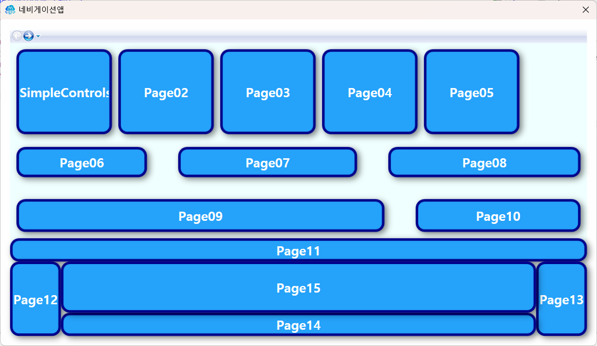


#### Presenter(나중에)
- 컨트롤의 실제 내용을 화면에 표시하는 자리


### 키오스크앱
- 결재이전까지 동작하는 버전
- WPF를 사용해서 구현


### Open AI 연동 앱
- 미세먼지 모니터링
- 국가교통정도
- Iot 모니터링 앱
