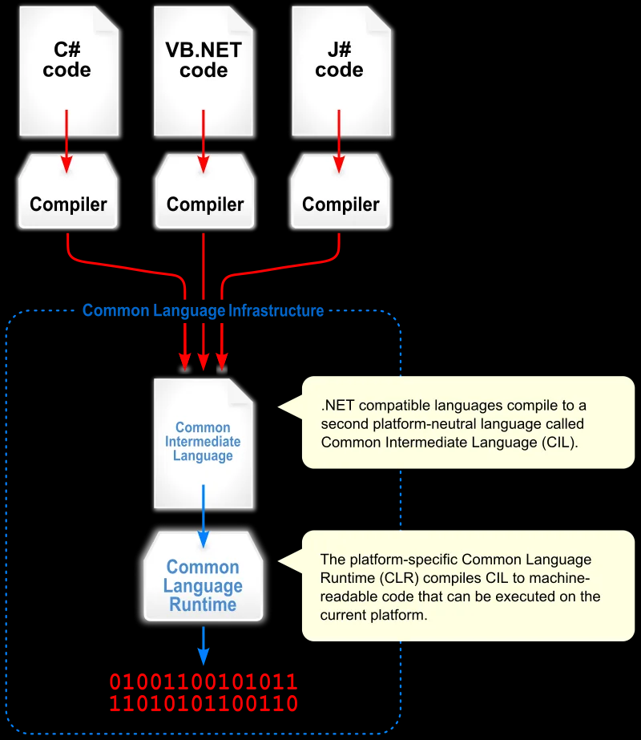
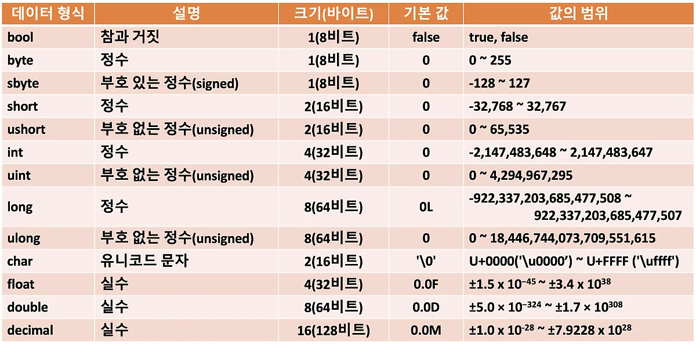

# iot-dotnet-2026
IoT 개발자 닷넷 리포지토리


## 1dlfck


### C# 기본

- 현 세대 프로그래밍 언어 랭킹 5위
- C++, 파이썬, 자바와 동일한 객체지향 프로그래밍 언어
- MS 윈도우에 종속적이었지만 현재 멀티플랫폼으로 변환 중
- 자마린으로 모바일 앱 개발 가능
- 유니티 게임 엔진 기본 스크립트 채택
- 스마트 팩토리, KIOSK 개발 등에 많이 활용


### C#은 닷넷 프레임 워크 위에서 동작함 
- 자바는 버주얼머신 위에서 동작
- C#은 닷넷 프레임워크(VM)위에서 동작함
- .NET 프레임워크의 구조를 따르면 무슨 언어든지 동작가능
    - C#, VB, J#, F#, C++.NET, Python....


https://wikidocs.net/227163

- 버전 명칭
    - .NET Framwork > .NET Core > .NET 5.0 이상

### C# 기본 구현
1. Visual studio 실행
2. C# 이 없으면 추가 기능 설치
    - ASP.NET 및 웹 개발 
    - .NET 데스크톱 개발 선택 
3. 비주얼스튜디오 재실행
4. 새 프로젝트 만들기
5. 언어 C# 선택
6. 콘솔 앱 선택
7. 새로 프로젝트 구성 : 프로젝트 명, 저장 위치, 솔루션 이름 지정
8. 추가정보: 프레임워크 선택, `최상위 문 사용안함`을 체크할 것


### C# 기본문법

- 주석 : 한 줄 주석(//), 여러줄 주석(/**/), xml 주석(///)
- 변수와 타입
    - 초기화 :`접근제한자 타입 변수명`
    - sbyte, byte, short, ushort, int, uint. long, ulong
    - float, double, decimal, char, bool
    

- 연산자 
    - c문법 동일
- 제어문
    - if, for, while
- 메서드
- 컬렉션
- 파일 입출력
- 객체지향
    - C++ 객체지향 클래스 내용과 동일 
    - 클래스 : 명사와 동사의 집합
    ```cs
    class Person {
        public string Name;

        public void Eat() {
            Console.WriteLine(Name + "이(가) 먹다.");
        }
    }

    static void Main() {
        Person p1 = new Person();
        p1.Name = "길동";
        p1.Eat();
    }
    ```
    - 생성자 : 클래스명과 동일한 특수메서드
    - 오버로딩 지원 : 메서드 파라미터 갯수가 다르면 가능
    - 상속: 동일하게 사용가능, 단일 클래스 상속 지원(멀티클래스는 인터페이스로 대체)
    - 오버라이딩 가능: 부모클래스의 메서드와 다르게 동작하는 메서드로 변경
    - this : 자기 클래스를 지칭할 때 


- 클래스 속성에서 
    - get; : 속성의 값을 가져올 수 있음
    - set; : 속성의 값을 변경할 수 있음
    - get; set; : 속성값 변경 및 가져오기 가능


- 컬렉션 
    - 배열, 리스트 등 여러요소를 묶어서 사용하는 구조
    - ArrayList, List, Hashtable, Dictionary, Stach, Queue, Hashset ....
    - foreach : 파이썬에서 for i in range(n) 과 동일한 기능
    - 배열보다 컬렉션을 사용할 것

- 예외처리 
    - try ~ catch ~ finally 형식 사용


### MSDN


### C# 프로그래밍
- C#으로 프로그램을 구현한다는 뜻
    - 윈도우 애플리케이션(winapp), 웹앱, 유니티, 모바일(MAUI), 키오스크(WPF)
    - GUI 활용
### 윈앱

- WinForms, Window Application, GUI -> WinApp으로 통일해서 명명
    - Windows Forms : 가장 오래된 윈앱 개발 방식
    - WPF: 좀 더 최신의 윈앱 개발 방식

- 윈앱 개발에는 각 두개로 구분되어 있음
    - .NET Framework : .NET Framework 4.8 이전 구형 개발방식 
    - 기본 : .NET 5.0 이상의 최신 개발방식

### 윈폼즈 앱 구현

1. 새프로젝트
2. 프로젝트명, 위치, 솔루션명 지정해서 다음으로 넘김
3. 프레임워크 .NET 10.0 선택 후 
4. IDE 툴에서 펑션키 f4로 속성창 오픈
5. 보기 > 도구상자 클릭 
6. 기본 개발화면 

7. 저장할때는 항상 ctrl+shift+s 로 저장할것
8. 도구상자의 컨트롤을 디자인 화면으로 드래그해서 구성 
9. 컨트롤의 속성 변경으로 디자인 적용 
10. 컨트롤의 이벤트 추가로 기능 구현
11. 디자이너 화면 `f7` <--> 비하인드코드 `shift + f7


### 윈폼즈
- 모달, 모달리스  : 부모창과 자식창의 관계
    - 모달 : 서브창 종료전에는 부모창 종료 불가
    - 모달리스 : 서브창 종료와 관계 없이 부모창 제어 가능

- 속성 변경방법
    - 디자인타임 변경 : 작업시 속성창의 속성값 변경
    - 런타임 변경 : 비하인드 코드 내에서 속성값을 변경 실행시 변경되는 것