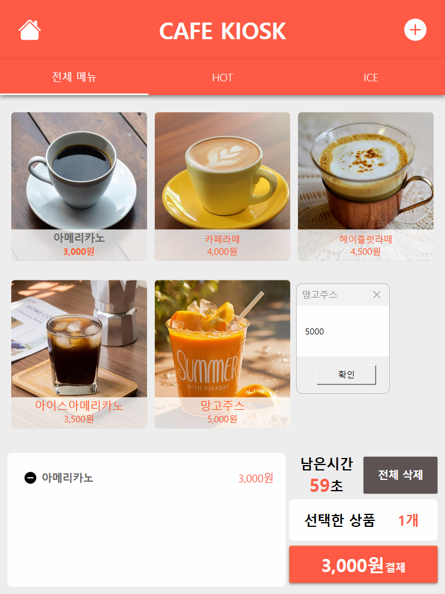
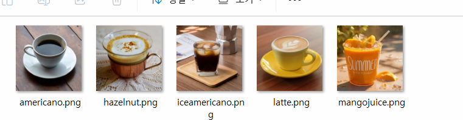
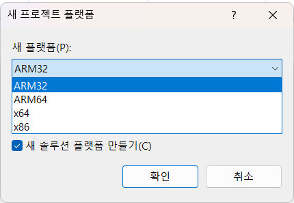
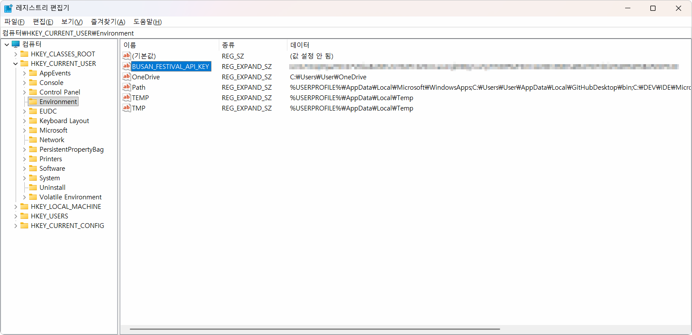

# iot-dotnet-2026
IoT 개발자 닷넷 리포지토리

## WPF 실습

### 키오스크앱
#### 데이터베이스 연동 및 테이블 생성 
    - cafekiosk 데이터베이스 생성
    - menu 테이블 생성
```xml
CREATE TABLE menu
(
    menu_id INT PRIMARY KEY AUTO_INCREMENT,
    menu_name VARCHAR(100) NOT NULL,
    price INT NOT NULL,
    image_path VARCHAR(255),
    category VARCHAR(20),
    is_sale CHAR(1) DEFAULT 'Y'
);
```
#### 모델 클래스 
- menuitem - dbmenu 테이블과 매핑
- order item 주문 리스트 저장


#### 이미지 구현




### 구현 계속
- 옵션 팝업창에서 수량 선택한 내용 주문담기 버튼 기능

- 키오스크 리스트뷰 음료 리스트업
- 선택한 상품, 결제 버튼 ,비용 갯수 연동
- 전체 삭제 기능
- 나음시간 완료 후 전체내용 초기화 
- 홈버튼 클릭 초기화 


# 1.2. OpenAPI 연동앱 개발
### Open AI 연동 앱
- 웹 서비스 종류 
    - 웹 사이트 - 디자인 적용된 프론트엔드와 데이터를 핸들링하는 백엔드 전부 서비스
    - OpenAPI - 프론트엔드 없이 데이터만 제공하는 서비스
- OpenAPI 활용처
    - 모바일 앱, IoT데이터 연동


- 서비스 url 구조
    - 기본 url 
    - get method url - 원하는 서비스를 요청하는 값, 키밸류 쌍, 시작은 ? 를 사용한다. 구분자는 &이다.
        - ?serviceKey = 서비스 키 - 데이터포털에서 할당받은 서비스키
        - &pageNo = 1   페이지번호
        - &numOfRows = 20    한페이지에 보여줄 행의 수
        - &rowNum = 1     시작행 번호
        - &resultType = json    결과형식(json, xml)

- json 타입 데이터 - wpf 앱에서 핸들링

    - DB데이터 연동방법과 유사


#### 부산축제 정보 앱 
- 공공데이터 포털 > 부산 축제정보 서비스 신청
- WPF앱 
    - Newtonsoft.Json.dll
    - MahApps.Metro
    - MahApps.Metro.IconPacks
    - CefSharp.Wpf.NETCore - 웹브라우저 패키지
    - Nlog

- UI 디자인
- 서비스 클래스, 데이터 모델 클래스 
- 구성  관리자 플랫폼
    - Anycpu는 자체적으로 검사해서 선택함
    
### JSON
- JavaScript Object Notation 약자
    - 자바스크립트에서 데이터를 표현하는 방법으로 만든 표준

```json
{
    "제목" : "부산 불꽃 축제",
    "날짜" : "2026-10-08",
    "장소" : "부산광역시",
    "입장료" : 5000
}
```
#### 데이터포털서비스키 설정
- 설정방법
    1. 제공키 일반 복사로 공개 
    2. 암호화로 저자으 복호화사용
    3. 윈도우 환경변수 저장, setx 명령어 사용
    4. 닷넷, user  secrets 기능 사용

- 윈도우 환경변수 등록
```powershell
#등록
>$env:BUSAN_FESTIVAK_API_KEY
```
- 레이스트리 편집기에서 등록한 서비스 키 확인


- 닷넷 User Secrets - 프로젝트 위치에서 실행
```powershell
> dotnet user-secrets set  "FestivalApiKey" 발급키
```

#### 중간실행 결과


#### 스마트홈 솔루션


## Unity 실습