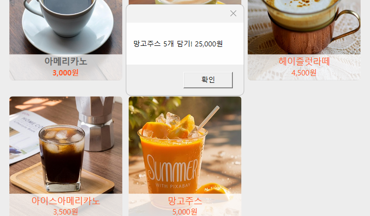
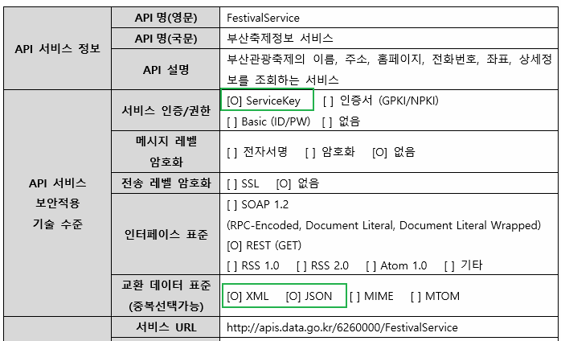
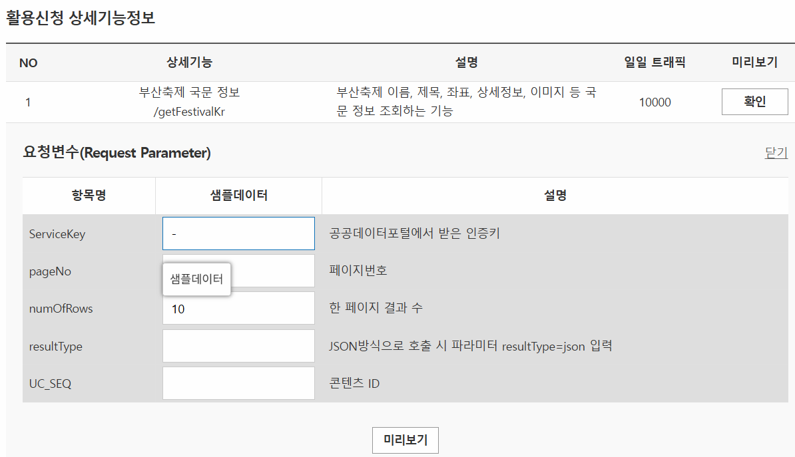
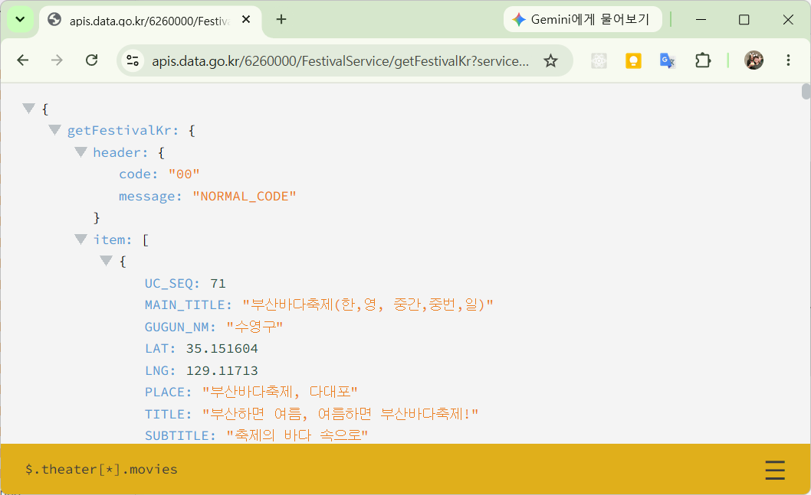
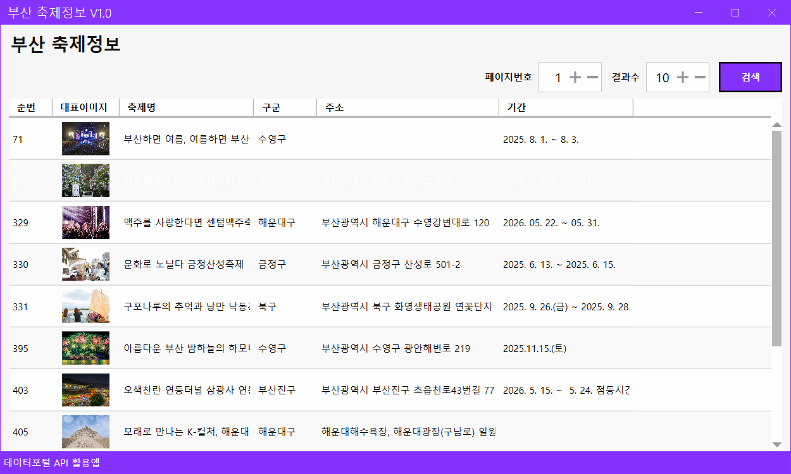
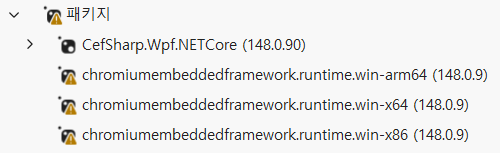
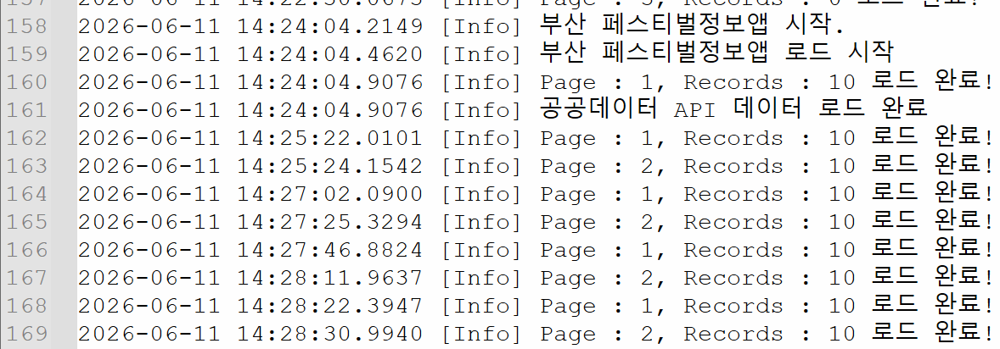
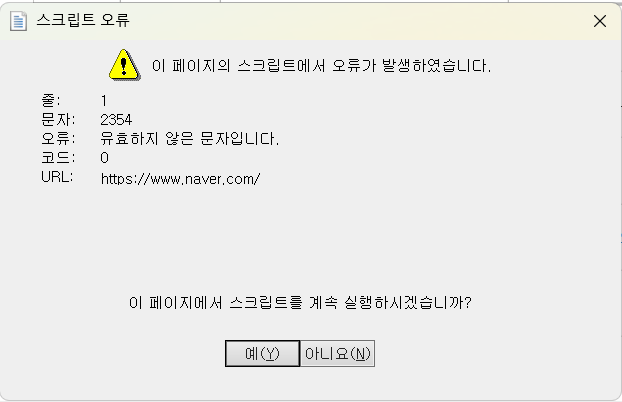
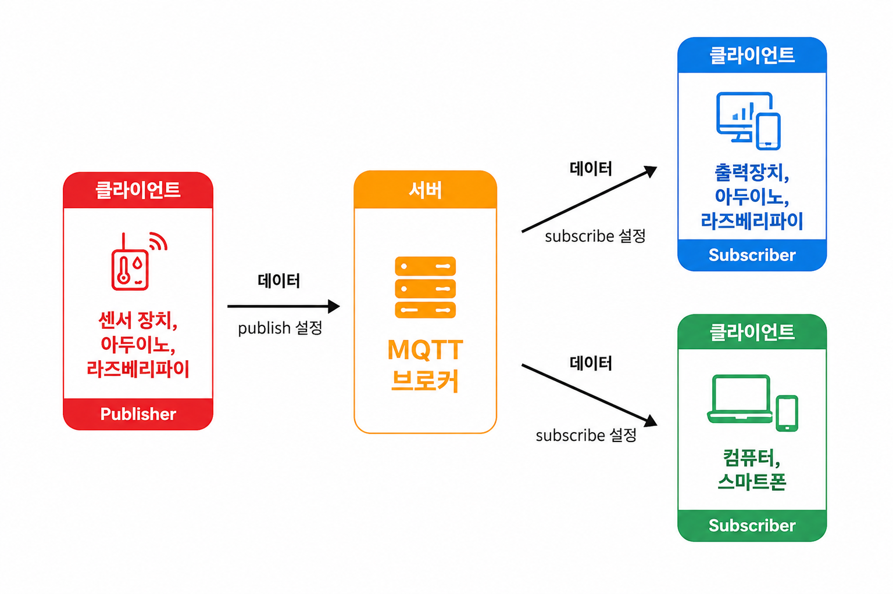
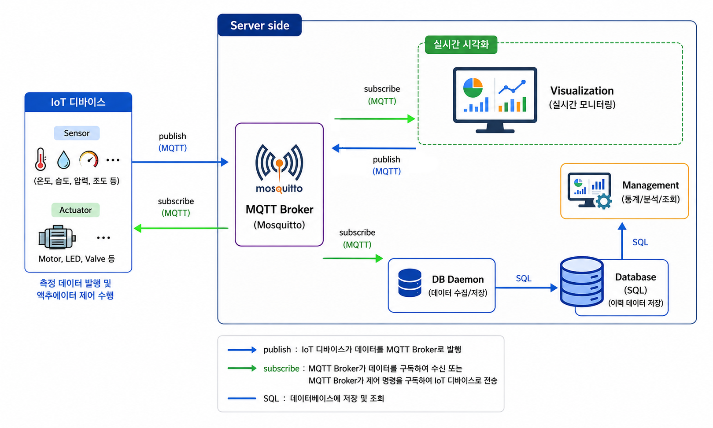

# 2026 닷넷 개발자 데스크톱 개발

## 1. WPF 실습

### 1.1. 카페 키오스크 개발

- 사용 스펙

  - WPF (.NET 10.0)
  - MaterialDesign (MaterialDesignThemes)
  - MySQL + DBeaver

#### 프로젝트 생성

- WpfCafeKiosk
- NuGet Package, MaterialDesignThemes, MySQLConnector 설치
- MahApps.Metro.IconPacks 추가 설치
- 

#### 프로젝트 구성

- WPF 머티리얼디자인 적용
- 키오스크 UI 제작
- 메뉴 모델, 주문 모델 생성
- 메뉴버튼 하드코딩
- MySQL menu 테이블 생성
- DB에서 메뉴 조회
- 메뉴버튼 동적생성
- 주문목록, 총액 계산

#### MaterialDesign 적용

* App.xaml에 리소스딕셔너리 적용

#### MySQL DB, Table 생성

* cafekiosk 데이터베이스 생성
* menu 테이블 생성
* orders, order_detail 테이블 생성

```sql
CREATE TABLE menu
(
    menu_id INT PRIMARY KEY AUTO_INCREMENT,  
    menu_name VARCHAR(100) NOT NULL,  
    price INT NOT NULL,  
    image_path VARCHAR(255),
    category VARCHAR(20),
    is_sale CHAR(1) DEFAULT 'Y'
);

CREATE TABLE orders
(
    order_id INT PRIMARY KEY AUTO_INCREMENT,
    order_date DATETIME NOT NULL DEFAULT CURRENT_TIMESTAMP,
    total_count INT NOT NULL,
    total_amount INT NOT NULL
);

CREATE TABLE order_detail
(
    detail_id INT PRIMARY KEY AUTO_INCREMENT,
    order_id INT NOT NULL,
    menu_id INT NOT NULL,
    menu_name VARCHAR(100) NOT NULL,
    price INT NOT NULL,
    count INT NOT NULL,
    total_price INT NOT NULL,
    CONSTRAINT fk_order_detail_orders
        FOREIGN KEY (order_id)
        REFERENCES orders(order_id)
);
```


#### 모델 클래스

* MenuItem - DB menu테이블과 매핑
* OrderItem - 주문리스트 저장

#### 이미지 작업

- Pixbay등 사이트에서 다운로드
- 일부 편집
- Images 폴더에 붙여넣기


#### MainWindow UI 작업 및 기본 이벤트


#### 메뉴 옵션 팝업창 작업


#### 기본 동작 이벤트 구현

https://github.com/user-attachments/assets/3fab497c-5e01-4800-bcfa-f0301174ea63

### 카페 키오스크 구현 리스트

- [X] 옵션 팝업창에서 수량 선택한 내용 주문담기 버튼 기능구현
- [X] 키오스크 리스트뷰 음료 리스트업
- [X] 선택한 상품, 결제버튼 비용, 갯수연동
- [X] 전체 삭제 기능
- [X] 남은 시간 완료 후 전체내용 초기화
- [X] 홈 버튼 클릭 초기화
- [X] 메인창에서 옵션창으로 MenuId 전달
- [X] DB연동!! 메뉴 SELECT /주문내역 INSERT
- [X] 메뉴 동적 바인딩!!
- [ ] DB저장 후 신용카드 결제 팝업(더미)

#### 옵션창 주문내역 확인



- `Tag={Binding}` - 객체 자체의미, OrderItem 객체 자체. 하위에서 MenuName, Count 등 사용 가능
- Margin, Padding 위치 순서 - Left, Top, Right, Bottom / Left&Right, Top&Bottom 순서
- CornerRadius 위치 순서 - TopLeft, TopRight, BottomRight, BottomLeft / TopLeft&BottomRight, TopRight&BottomLeft 순서

#### 실행결과

https://github.com/user-attachments/assets/1003c297-420b-46f2-8b83-9a4a416dee7e

#### 로그확인 방법

- 프로젝트 속성 > 출력 유형


- Windows 애플리케이션 -> 콘솔 애플리케이션 변경
- MessageBox.Show() 대신 Console.WriteLine() 메서드 변경
- 실행로그 확인


#### DB 주문내역 등록

- DabaseHelper에 INSERT 처리 메서드 생성
- MainWindow.xaml.cs에 저장쿼리 실행 메서드 생성
- BtnPay_Click 이벤트핸들러에 저장 메서드 추가

#### 최종 작업

- 프로젝트 속성 > 출력 유형, Windows 애플리케이션으로 변경
- 구성관리자 Debug -> Release로 변경 빌드
- 배포...

#### 전체 실행결과

https://github.com/user-attachments/assets/403de1f6-c17f-4595-90b7-f50b87cc80dc

---

### 1.2. OpenAPI 연동앱 개발

#### OpenAPI 개요

- 웹 서비스 종류

  - 웹 사이트 - 디자인 적용된 프론트엔드와 데이터를 핸들링하는 백엔드 전부 서비스
  - OpenAPI(RestAPI) - 프론트엔드 없이 데이터만 제공하는 서비스
- OpenAPI 활용처

  - 모바일 앱 - 버스도착 앱, 날씨조회 앱, 영화검색 앱...
  - IoT 데이터 연동 - 데이터 전달 인터페이스
  - SNS 연동
  - 결제시스템
- [공공데이터 포털](https://data.go.kr)

  - 국가 공공데이터 사용 창구
  - 회원가입 후, 개인 API인증키 발급
  - 데이터 찾기, 활용신청

#### 공공데이터 사용법

- 활용신청 현황

  
- 참고문서 확인 - json을 서비스 지원 확인

  
- URL 사용할 일반인증키(Encoding) ServiceKey에 사용

  
- 크롬 브라우저 사용시 - Chrom 웹스토어 > `Seven JSON Viewer` 검색, 설치

  
- 서비스URL 구조

  - 기본 URL - https://apis.data.go.kr/6260000/FestivalService/getFestivalKr
  - **Get Method URL** - 원하는 서비스를 요청하는 URL값, `Key=Value`쌍. 시작은 `?`, 구분자는 `&`
    - ?serviceKey=서비스키 - 데이터포털에서 할당받은 서비스키
    - &pageNo=1 - 요청할 페이지 번호
    - &numOfRows=10 - 한페이지당 데이터 수
    - &resultType=json - 결과타입(xml, json)
- json 타입 데이터 - WPF앱에서 핸들링

  - DB데이터 연동방법과 유사


#### 부산축제 정보 앱

- 공공데이터 포털 > 부산 축제정보 서비스 신청
- WPF 앱 패키지 설치
  - Newtonsoft.Json
  - MahApps.Metro
  - MahApps.Metro.IconPacks
  - CefSharp.Wpf.NETCore - 웹브라우저 패키지(구글맵 표현)
  - NLog - 로그 작성 패키지

- UI 디자인
- 서비스 클래스, 데이터 모델 클래스

- 구성
  - WpfBusanFestivalApp
    - Models
      - 관련 클래스
    - Services
      - 관련 클래스
    - MainWindow.xaml
    - MapWindow.xaml

- 구성관리자 플랫폼
  - Any CPU - 현재 OS 확인해서 알맞은 플랫폼 사용
  - ARM - 임베디드 저전력장치 CPU 아키텍처. Advanced RISC Machines 약자
    - ARM32 - 32비트(Integer를 표현크기) OS동작 아키텍처
    - ARM64 - 64비트 OS 아키텍처
  - AMD - ARM 비교하기위해서 사용하는 OS 아키텍처. Intel CPU동일한 의미
    - x86 - 32비트 OS
    - `x64` - 64비트 OS. 현재 윈도우 기본

  

#### JSON
- JavaScript Object Notation 약자
  - 자바스크립트에서 데이터를 표현하는 방법으로 만든 표준
  - 아래의 문법형태로 데이터를 네트워크로 전달
  - 중괄호로 데이터 범위 지정, 키는 문자열, 데이터는 숫자, 문자열, 불린 등, : 으로 구분

  ```json
  {
    "제목" : "부산불꽃축제",
    "날짜" : "2026-10-08",
    "장소" : "부산광역시",
    "입장료" : 5000
    "진행여부" : true,
    "리스트" : [ 1, 2, 3, 4, ... ],
    "이미지" : "x09xFF...",
    {
      // 하위데이터 
    }
  }
  ```
  - JSON 텍스트 <--> 클래스 객체 변환 - Newtonsoft.json 패키지 사용

#### ChatGPT 사용 UI 요청
- WPF MahApps.Metro UI 요청 프롬프트
  ```
  WPF로 업로드한 그림과 동일한 구조로 xaml 파일을 만들어줘. 
  MahApps.Metro 패키지 사용중이고 부산 축제정보 앱을 만들거야
  ```
  - AI가 생성한 리소스 디자인 사용 못함. MahApps.Metro 사용
  - NumericUpdown 컨트롤 prefix(mah:) 추가 필요

#### 데이터포털 서비스키 설정

- 설정 방법
  1. 제공키 일반 복사로 공개
  2. 암호화로 저장, 복호화 사용
  3. 윈도우 환경변수 저장, setx 명령어 사용
  4. 닷넷 User Secrets 기능 사용, dotnet user-secrets set 

- 윈도우 환경변수 등록
  ```powershell
  # 등록
  > setx BUSAN_FESTIVAL_API_KEY "발급받은키"

  # 콘솔 재시작!
  > $env:BUSAN_FESTIVAL_API_KEY
  발급받은키
  ```

- 레지스트리편집기에서 등록한 서비스키 확인
  

- 닷넷 User Secrets - 프로젝트 위치에서 실행
  ```powershell
  # 초기화
  > dotnet user-secrets init
  # 키 등록
  > dotnet user-secrets set "FestivalApiKey" "발급받은키"
  # 키 확인
  > dotnet user-secrets list
  ```

#### 중간 실행결과



#### 추가 작업

- [x] NLog 로그처리
- [x] MahApps.Metro.IconPacks 사용
- [x] 페이지번호, 결과수 파라미터 사용 검색
- [x] 데이터그리드 포커스 색상 반전
- [x] 기타 예외처리
- [x] 데이터그리드 레코드 더블클릭시 상세정보 및 지도 팝업
- [x] 상세정보 상세내용 HTML 태그 삭제
- [x] 상태표시줄 로드완료 메시지 출력
- [x] 상세정보 홈페이지 띄우기
- [x] 비동기 메서드 수정

#### C# 코딩방식 변경
- 좀더 효율적인 코딩방식 채택
```cs
// 1번 예전 C#방식
if (response != null &&  
    response.FestivalData != null &&
    response.FestivalData.Items != null)
{
    return response.FestivalData.Items;
} 
else
{
    return new ObservableCollection<FestivalItem>(); // 빈 리스트
}

// 2번 좀더 최근 C#방식
return response?.FestivalData?.Items?? new ObservableCollection<FestivalItem>();
```

- ?. response 가 null이면 null을 반환, 아니면 response.FestivalData로 진입
- ??  객체가 null이면 ?? 다음의 객체로 반환

#### NuGet 패키지

- 느낌표 아이콘이 뜨면 패키지 사용이 거의 불가



#### NLog
- .NET 앱용 로깅 라이브러리
- 이전 log4j.net 자바라이브러리를 C#용으로 수정한 라이브러리 사용
- MessageBox.show(), Console.WriteLine() 디버깅 후에 주석처리 또는 삭제
- 로그를 파일이나 DB에 저장하는 형태로 사용 가능

##### NuGet 패키지에서 설치

##### NLog.config 설정
- 프로젝트 최상위 폴더에서 xml 파일로 NLog.config를 생성
- 아래와 같이 작성

  ```xml
  <?xml version="1.0" encoding="utf-8" ?>
  <nlog xmlns="http://www.nlog-project.org/schemas/NLog.xsd" xmlns:xsi="http://www.w3.org/2001/XMLSchema-instance"
        xsi:schemaLocation="http://www.nlog-project.org/schemas/NLog.xsd NLog.xsd">

      <targets>
          <target name="logfile" xsi:type="File" fileName="logfile.txt" />
          <target name="logconsole" xsi:type="Console" />
      </targets>

      <rules>
          <logger name="*" minlevel="Info" writeTo="logconsole" />
          <logger name="*" minlevel="Debug" writeTo="logfile" />
      </rules>
  </nlog>
  ```

- NLog.config 파일 속성 > `빌드 작업 : 내용(컨텐츠)`, `출력 디렉토리로 복사 : 항상 복사` 변경
- 빌드

##### NLog 사용법

```cs
// NLog 기본 객체 생성방법
private readonly Logger logger = LogManager.GetCurrentClassLogger();

logger.Info("부산 페스티벌정보앱 시작.");
logger.Trace("트레이스");
logger.Debug("디버그");
logger.Warn("경고");
logger.Error("예외발생");
logger.Fatal("메우 중대한 오류");
```



#### Common 클래스 생성

```cs
public static readonly Logger logger = LogManager.GetCurrentClassLogger();
```

#### WinForms, WPF 기본 웹브라우저 컨트롤 문제

- HTML렌더링 엔진이 최신 스크립트를 지원하지 않음



- CefSharp.WPF 라이브러리 사용

#### 추가 개발건

- [ ] (하) 결과수에서 값을 변경하고 엔터키를 누르면 바로 검색진행
- [ ] (하) 전체 데이터수를 넘어서는 페이지번호, 결과수 제약
- [ ] (하) 웹사이트 링크대신 아이콘버튼으로 변경
- [ ] (하) MIDDLE_SIZE_RM1 장애인 정보 표현
- [ ] (중) HTMl 삭제 대신 CefSharp.WPF 브라우저로 HTML 렌더링 표현
- [ ] (상) 유튜브 검색결과와 연동, 링크누르면 유튜브 실행하게
- [ ] (상) 구글맵 API 사용해서 구글맵 표현

#### 데이터포털 부산 API 활용방법
- 축제정보와 거의 동일한 서비스 
  - 부산광역시_부산맛집정보 서비스
  - 부산광역시_부산명소정보 서비스
  - 부산광역시_부산테마여행정보 서비스
  - 부산광역시_부산도보여행정보 서비스
  - 부산광역시_부산쇼핑정보 서비스

- 유사한 서비스
  - 부산광역시_공연장 목록 서비스
  - 부산광역시_갈맷길 코스 정보 서비스
  - 부산광역시_구군 모범음식점 현황

- 관광공사에서 API를 신규발급 서비스
  - 부산 음식테마거리
  - 부산 7beach 음식관광


#### 완성 실행결과

https://github.com/user-attachments/assets/b2f63508-2c0e-4b86-93fe-90f76c27550c

### 1.3. SmartHome 솔루션

#### MQTT

- Message Queuing Telmetry Transport 프로토콜 명칭
- IoT 장치간에 데이터를 주고받을 수 있도록 개발
- ISO/IEC 20922 국제 표준
- 발행-구독(Publish-Subscribe) 기반
  - Apache Kafka : Java, Spring Boot
  - ROS2 DDS : 로봇
  - MQTT : IoT, 스마트팩토리
  - RabbitMQ : 기업메시징
  - SignalR : 실시간웹
  - WebSocket 브로드캐스트 : 실시간웹
- 소켓통신, TCP/IP 기반

- MQTT 동작방식



- MQTT 시스템 구성도



#### WPF SmartHome 프로젝트

- Dummy Sensing Data 생성, 송신 시뮬레이터 앱 구현
- MQTT 브로커 설치 및 설정
- SmartHome 모니터링 앱 구현

#### MQTT 브로커

#### Dummy Simulator앱

#### SmartHome 모니터링 앱

### MVVM은 나중에

#### Dummy IoT Data 생성
- 1초마다 DB에 저장

## Unity 실습
